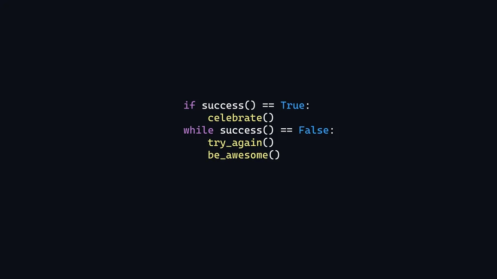

 
<!-- 

    
    
    
    

 -->
 

#  Hello,World!  
Software Engineer , Product Enthusiast , Currently pursuing Master's at Northeastern University , Feel free to check out my projects and reach out to me :) 

[Currently learning JavaScript](https://github.com/kartik-99/textbookGPT)

<h1 style="display: flex; align-items: center;">
  
  Tech I worked with
</h1>

| Category        | Skills        |
|-----------------|---------------|
| Languages |       |
|Software Development Tools and Frameworks |        |
| Cloud Platforms and Technologies |      |
| Databases |      |
| Mathematics  |   
 

<!-- 
Spare commented code incase the table code gets too complicated
Languages

 
 

 

Python Libraries
 
 

 
 
 
 
 

Libraries, Tools and Frameworks

 
 
 

 

Cloud Platforms I worked on
 
 

Databases

 
 
 

Maths & AI

 -->
